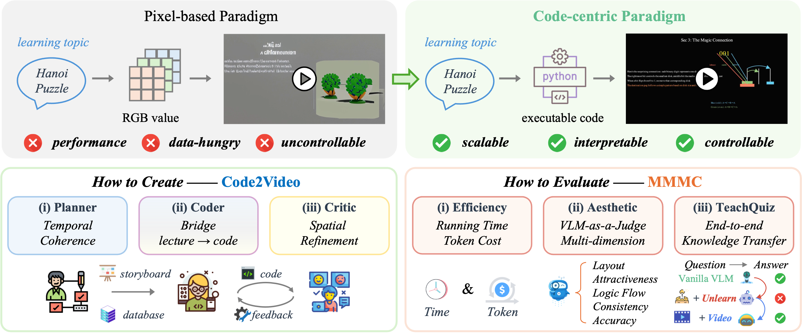
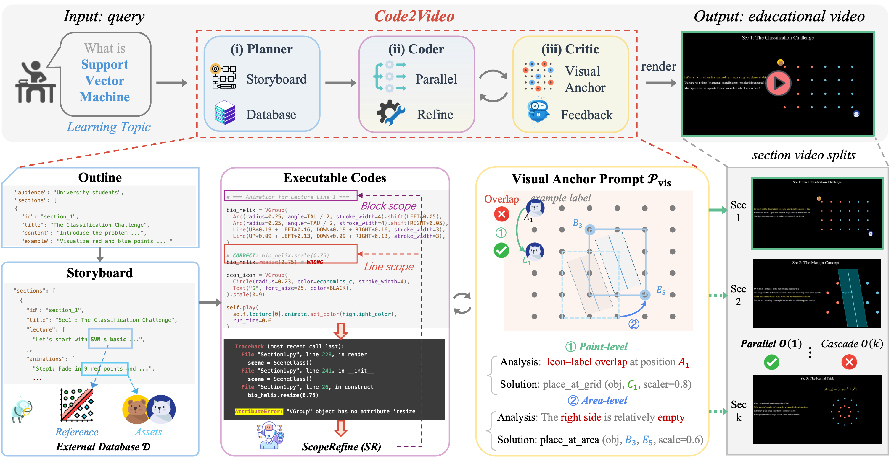

# Code2Video: Code-centric Video Generation

<!-- <p align="center">
  
  <span style="font-size: 1.8em; font-weight: bold;">Code2Video: Agentic Code-Centric Framework for Educational Video Generation</span>
</p> -->

<p align="center">
  
</p>

<!-- <p align="center">
  
  <span style="font-size: 1.8em; font-weight: bold;"><em> From code to classroom-ready videos, powered by agents that teach.</em></span>
</p> -->

<p align="center">
  <em>From code to classroom-ready videos, powered by agents that teach.</em>
</p>

<p align="center">
  <em>教学相长，代码为梁；知识作航，动画生光</em>
</p>


<p align="center">
  <a href="https://scholar.google.com.hk/citations?user=9lIMS-EAAAAJ&hl=zh-CN&oi=sra">Yanzhe Chen</a>,
  <a href="https://qhlin.me/">Kevin Lin Qinghong</a>,
  <a href="https://scholar.google.com/citations?user=h1-3lSoAAAAJ&hl=en">Mike Zheng Shou</a> <br>
  Show Lab @ National University of Singapore
</p>


<p align="center">
  <a href="https://arxiv.org/abs/xxx">📄 Paper</a> &nbsp; | &nbsp;
  <a href="https://huggingface.co/datasets/YanzheChen/MMMC">🤗 Dataset</a> &nbsp; | &nbsp;
  <a href="https://chenanno.github.io/Code2Video/">🌐 Project Website</a> &nbsp; | &nbsp;
  <a href="https://twitter.com/intent/tweet?text=Check%20out%20Code2Video!">💬 X (Twitter)</a>
</p>

---

## 🌟 Overview

<p align="center">
  
</p>

**Code2Video** is an **agentic, code-centric framework** that generates high-quality **educational videos** from knowledge points.  
Unlike pixel-based text-to-video models, our approach leverages executable **Manim code** to ensure **clarity, coherence, and reproducibility**.

**Key Features**:
- 🎬 **Code-Centric Paradigm** — executable code as the unified medium for both temporal sequencing and spatial organization of educational videos.
- 🤖 **Modular Tri-Agent Design** — Planner (storyboard expansion), Coder (debuggable code synthesis), and Critic (layout refinement with anchors) work together for structured generation.
- 📚 **MMMC Benchmark** — the first benchmark for code-driven video generation, covering 117 curated learning topics inspired by 3Blue1Brown, spanning diverse areas.
- 🧪 **Multi-Dimensional Evaluation** — systematic assessment on efficiency, aesthetics, and end-to-end knowledge transfer.

---

## 🚀 How to Create -- Code2Video

<p align="center">
  
</p>

### 1. Requirements

```bash
pip install -r requirements.txt
````

### 2. Configure LLM API Keys

Fill in your **API credentials** in `gpt_config.json`.

* **LLM API**: 
  * Required for Planner & Coder.
  * Best Manim code quality achieved with **Claude-4-Opus**.
* **VLM API**:
  * Required for Planner Critic.
  * For layout and aesthetics optimization, provide **Gemini API key**.
  * Best quality achieved with **gemini-2.5-pro-preview-05-06**.

* **Visual Assets API**:

  * To enrich videos with icons, set `ICONFINDER_API_KEY` from [IconFinder](https://www.iconfinder.com/account/applications).

### 3. Run Agents

We provide two shell scripts for different generation modes:

#### (a) Full Benchmark Mode

Script: `run_agent.sh`

Runs all (or a subset of) learning topics defined in `long_video_topics_list.json`.

```bash
sh run_agent.sh
```

**Important parameters inside `run_agent.sh`:**

* `API`: specify which LLM to use.
* `FOLDER_PREFIX`: name prefix for saving output folders (e.g., `TEST-LIST`).
* `MAX_CONCEPTS`: number of concepts to include (`-1` means all).
* `PARALLEL_GROUP_NUM`: number of groups to run in parallel.

---

#### (b) Single Knowledge Point Mode

Script: `run_agent_single.sh`

Generates a video from a single **knowledge point** specified in the script.

```bash
sh run_agent_single.sh --knowledge_point "Linear transformations and matrices"
```

**Important parameters inside `run_agent_single.sh`:**

* `API`: specify which LLM to use.
* `FOLDER_PREFIX`: output folder prefix (e.g., `TEST-single`).
* `KNOWLEDGE_POINT`: target concept, e.g. `"Linear transformations and matrices"`.

---

### 4. Project Organization

A suggested directory structure:

```
Code2Video/
│── agent.py
│── run_agent.sh
│── run_agent_single.sh
│── api_config.json
│── ...
│
├── assets/
│   ├── icons/          #  downloaded visual assets cache via IconFinder API
│   └── reference/      # reference images
│
├── json_files/         # JSON-based topic lists & metadata
├── prompts/            # prompt templates for LLM calls
├── CASES/              # generated cases, organized by FOLDER_PREFIX
│   └── TEST-LIST/      # example multi-topic generation results
│   └── TEST-single/    # example single-topic generation results
```


---

## 📊 How to Evaluate -- MMMC

We evaluate along **three complementary dimensions**:

1. **Knowledge Transfer (TeachQuiz)**

   ```bash
   python3 eval_TQ.py
   ```

2. **Aesthetic & Structural Quality (AES)**

   ```bash
   python3 eval_AES.py
   ```

3. **Efficiency Metrics (During Creating)**

   * Token usage
   * Execution time


👉 More data and evaluation scripts are available at:
[HuggingFace: MMMC Benchmark](https://huggingface.co/datasets/YanzheChen/MMMC)

---

## 🙏 Acknowledgements

* Video data is sourced from the **[3Blue1Brown official lessons](https://www.3blue1brown.com/#lessons)**.
  These videos represent the **upper bound of clarity and aesthetics** in educational video design and inform our evaluation metrics.
* We thank all the **Show Lab @ NUS** members for support!
* This project builds upon open-source contributions from **Manim Community** and the broader AI research ecosystem.
* High-quality visual assets (icons) are provided by **[IconFinder](https://www.iconfinder.com/)** and  **[Icons8](https://icons8.com/icons)**, which were used to enrich the educational videos.


---

<!-- ## 📌 Citation

If you find our work useful, please cite:

```bibtex
@article{chen2025code2video,
  title={Code2Video: Agentic Code-Centric Framework for Educational Video Generation},
  author={Chen, Yanzhe and Lin, Qinghong and Shou, Mike Zheng},
  journal={ICLR},
  year={2026}
}
```

--- -->
