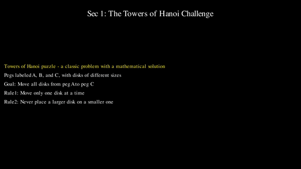
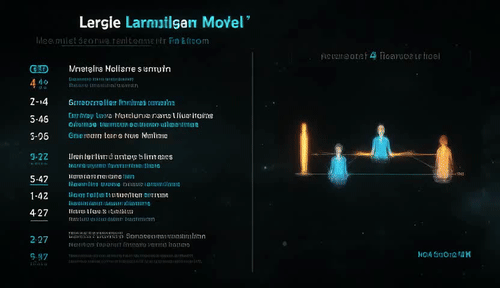
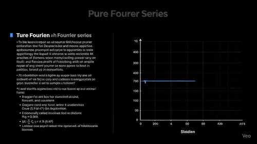
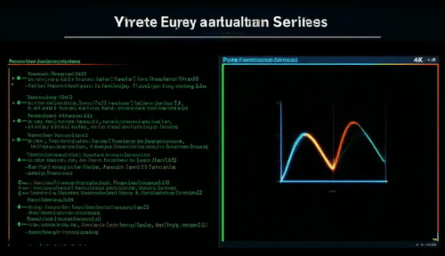
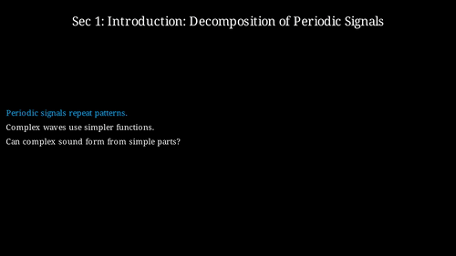

# Code2Video: Video Generation via Code


<p align="center">
  <b>Code2Video: A Code-centric Paradigm for Educational Video Generation</b>
</p>
<video src="assets/video.mp4" width="600" controls>
  Your browser does not support the video tag.
</video>


<p align="center">
  <a href="https://scholar.google.com.hk/citations?user=9lIMS-EAAAAJ&hl=zh-CN&oi=sra">Yanzhe Chen</a>,
  <a href="https://qhlin.me/">Kevin Qinghong Lin</a>,
  <a href="https://scholar.google.com/citations?user=h1-3lSoAAAAJ&hl=en">Mike Zheng Shou</a> <br>
  Show Lab @ National University of Singapore
</p>


<p align="center">
  <a href="https://arxiv.org/abs/2510.01174">📄 Paper</a> &nbsp; | &nbsp;
  <a href="https://huggingface.co/papers/2510.01174">🤗 Daily Paper</a> &nbsp; | &nbsp;
  <a href="https://huggingface.co/datasets/YanzheChen/MMMC">🤗 Dataset</a> &nbsp; | &nbsp;
  <a href="https://showlab.github.io/Code2Video/">🌐 Project Website</a> &nbsp; | &nbsp;
  <a href="https://x.com/KevinQHLin/status/1974199353695941114">💬 X (Twitter)</a>
</p>

https://github.com/user-attachments/assets/d906423f-734a-41c9-b102-b113ad3b3c25


<!-- <p align="center">
<table>
  <thead>
    <tr>
      <th style="text-align: center;">Learning Topic</th>
      <th style="text-align: center;">Veo3</th>
      <th style="text-align: center;">Wan2.2</th>
      <th style="text-align: center;">Code2Video (Ours)</th>
    </tr>
  </thead>
  <tbody>
    <tr>
      <td style="text-align: center; vertical-align: middle;"><strong>Hanoi Problem</strong></td>
      <td style="text-align: center;">
        
      </td>
      <td style="text-align: center;">
        
      </td>
      <td style="text-align: center;">
        
      </td>
    </tr>
    <tr>
      <td style="text-align: center; vertical-align: middle;"><strong>Large Language Model</strong></td>
      <td style="text-align: center;">
        
      </td>
      <td style="text-align: center;">
        
      </td>
      <td style="text-align: center;">
        
      </td>
    </tr>
    <tr>
      <td style="text-align: center; vertical-align: middle;"><strong>Pure Fourier Series</strong></td>
      <td style="text-align: center;">
        
      </td>
      <td style="text-align: center;">
        
      </td>
      <td style="text-align: center;">
        
      </td>
    </tr>
    </tbody>
</table>
</p> -->

<p align="center">
<table style="width: 90%; border-collapse: collapse; text-align: center; margin: auto;">
  <thead>
    <tr>
      <th style="text-align: center; padding: 8px;">Learning Topic</th>
      <th style="text-align: center; padding: 8px;">Veo3</th>
      <th style="text-align: center; padding: 8px;">Wan2.2</th>
      <th style="text-align: center; padding: 8px;">Code2Video (Ours)</th>
    </tr>
  </thead>
  <tbody>
    <tr>
      <td style="text-align: center; vertical-align: middle; font-weight: bold;">Hanoi Problem</td>
      <td>
        <div style="width: 320px; aspect-ratio: 16 / 9; overflow: hidden; margin: auto;">
          
        </div>
      </td>
      <td>
        <div style="width: 320px; aspect-ratio: 16 / 9; overflow: hidden; margin: auto;">
          
        </div>
      </td>
      <td>
        <div style="width: 320px; aspect-ratio: 16 / 9; overflow: hidden; margin: auto;">
          
        </div>
      </td>
    </tr>
    <tr>
      <td style="text-align: center; vertical-align: middle; font-weight: bold;">Large Language Model</td>
      <td>
        <div style="width: 320px; aspect-ratio: 16 / 9; overflow: hidden; margin: auto;">
          
        </div>
      </td>
      <td>
        <div style="width: 320px; aspect-ratio: 16 / 9; overflow: hidden; margin: auto;">
          
        </div>
      </td>
      <td>
        <div style="width: 320px; aspect-ratio: 16 / 9; overflow: hidden; margin: auto;">
          
        </div>
      </td>
    </tr>
    <tr>
      <td style="text-align: center; vertical-align: middle; font-weight: bold;">Pure Fourier Series</td>
      <td>
        <div style="width: 320px; aspect-ratio: 16 / 9; overflow: hidden; margin: auto;">
          
        </div>
      </td>
      <td>
        <div style="width: 320px; aspect-ratio: 16 / 9; overflow: hidden; margin: auto;">
          
        </div>
      </td>
      <td>
        <div style="width: 320px; aspect-ratio: 16 / 9; overflow: hidden; margin: auto;">
          
        </div>
      </td>
    </tr>
  </tbody>
</table>
</p>

---

## 🔥 Update
- [x] [2025.10.6] We have updated the ground truth human-made videos and metadata for the [MMMC](https://huggingface.co/datasets/YanzheChen/MMMC) dataset.
- [x] [2025.10.3] Thanks @_akhaliq for sharing our work on [Twitter](https://x.com/_akhaliq/status/1974189217304780863)!
- [x] [2025.10.2] We release the [arXiv](https://arxiv.org/abs/2510.01174), [code](https://github.com/showlab/Code2Video) and [dataset](https://huggingface.co/datasets/YanzheChen/MMMC) .
- [x] [2025.9.22] Code2Video has been accepted to the **Deep Learning for Code ([DL4C](https://dl4c.github.io/)) Workshop at NeurIPS 2025**.


---

### Table of Contents
- [🌟 Overview](#-overview)
- [🚀 Quick Start: Code2Video](#-try-code2video)
  - [1. Requirements](#1-requirements)
  - [2. Configure LLM API Keys](#2-configure-llm-api-keys)
  - [3. Run Agents](#3-run-agents)
  - [4. Project Organization](#4-project-organization)
- [📊 Evaluation: MMMC](#-evaluation----mmmc)
- [🙏 Acknowledgements](#-acknowledgements)
- [📌 Citation](#-citation)

---

## 🌟 Overview

<p align="center">
  
</p>

**Code2Video** is an **agentic, code-centric framework** that generates high-quality **educational videos** from knowledge points.  
Unlike pixel-based text-to-video models, our approach leverages executable **Manim code** to ensure **clarity, coherence, and reproducibility**.

**Key Features**:
- 🎬 **Code-Centric Paradigm** — executable code as the unified medium for both temporal sequencing and spatial organization of educational videos.
- 🤖 **Modular Tri-Agent Design** — Planner (storyboard expansion), Coder (debuggable code synthesis), and Critic (layout refinement with anchors) work together for structured generation.
- 📚 **MMMC Benchmark** — the first benchmark for code-driven video generation, covering 117 curated learning topics inspired by 3Blue1Brown, spanning diverse areas.
- 🧪 **Multi-Dimensional Evaluation** — systematic assessment on efficiency, aesthetics, and end-to-end knowledge transfer.

---

## 🚀 Try Code2Video

<p align="center">
  
</p>

### 1. Requirements

```bash
cd src/
pip install -r requirements.txt
````

Here is the [official installation guide](https://docs.manim.community/en/stable/installation.html) for Manim Community v0.19.0, to help everyone correctly set up the environment.

### 2. Configure LLM API Keys

Fill in your **API credentials** in `gpt_config.json`.

* **LLM API**: 
  * Required for Planner & Coder.
  * Best Manim code quality achieved with **Claude-4-Opus**.
* **VLM API**:
  * Required for Planner Critic.
  * For layout and aesthetics optimization, provide **Gemini API key**.
  * Best quality achieved with **gemini-2.5-pro-preview-05-06**.

* **Visual Assets API**:

  * To enrich videos with icons, set `ICONFINDER_API_KEY` from [IconFinder](https://www.iconfinder.com/account/applications).

### 3. Run Agents

We provide two shell scripts for different generation modes:

#### (a) Any Query

Script: `run_agent_single.sh`

Generates a video from a single **knowledge point** specified in the script.

```bash
sh run_agent_single.sh --knowledge_point "Linear transformations and matrices"
```

**Important parameters inside `run_agent_single.sh`:**

* `API`: specify which LLM to use.
* `FOLDER_PREFIX`: output folder prefix (e.g., `TEST-single`).
* `KNOWLEDGE_POINT`: target concept, e.g. `"Linear transformations and matrices"`.

---

#### (b) Full Benchmark Mode

Script: `run_agent.sh`

Runs all (or a subset of) learning topics defined in `long_video_topics_list.json`.

```bash
sh run_agent.sh
```

**Important parameters inside `run_agent.sh`:**

* `API`: specify which LLM to use.
* `FOLDER_PREFIX`: name prefix for saving output folders (e.g., `TEST-LIST`).
* `MAX_CONCEPTS`: number of concepts to include (`-1` means all).
* `PARALLEL_GROUP_NUM`: number of groups to run in parallel.

### 4. Project Organization

A suggested directory structure:

```
src/
│── agent.py
│── run_agent.sh
│── run_agent_single.sh
│── api_config.json
│── ...
│
├── assets/
│   ├── icons/          #  downloaded visual assets cache via IconFinder API
│   └── reference/      # reference images
│
├── json_files/         # JSON-based topic lists & metadata
├── prompts/            # prompt templates for LLM calls
├── CASES/              # generated cases, organized by FOLDER_PREFIX
│   └── TEST-LIST/      # example multi-topic generation results
│   └── TEST-single/    # example single-topic generation results
```


---

## 📊 Evaluation -- MMMC

We evaluate along **three complementary dimensions**:

1. **Knowledge Transfer (TeachQuiz)**

   ```bash
   python3 eval_TQ.py
   ```

2. **Aesthetic & Structural Quality (AES)**

   ```bash
   python3 eval_AES.py
   ```

3. **Efficiency Metrics (During Creating)**

   * Token usage
   * Execution time


👉 More data and evaluation scripts are available at:
[HuggingFace: MMMC Benchmark](https://huggingface.co/datasets/YanzheChen/MMMC)

---

## 🙏 Acknowledgements

* Video data is sourced from the **[3Blue1Brown official lessons](https://www.3blue1brown.com/#lessons)**.
  These videos represent the **upper bound of clarity and aesthetics** in educational video design and inform our evaluation metrics.
* We thank all the **Show Lab @ NUS** members for support!
* This project builds upon open-source contributions from **Manim Community** and the broader AI research ecosystem.
* High-quality visual assets (icons) are provided by **[IconFinder](https://www.iconfinder.com/)** and  **[Icons8](https://icons8.com/icons)**, which were used to enrich the educational videos.


---

## 📌 Citation

If you find our work useful, please cite:

```bibtex
@misc{code2video,
      title={Code2Video: A Code-centric Paradigm for Educational Video Generation}, 
      author={Yanzhe Chen and Kevin Qinghong Lin and Mike Zheng Shou},
      year={2025},
      eprint={2510.01174},
      archivePrefix={arXiv},
      primaryClass={cs.CV},
      url={https://arxiv.org/abs/2510.01174}, 
}
```

If you like our project, please give us a star ⭐ on GitHub for the latest update.
[](https://star-history.com/#showlab/Code2Video&Date)
